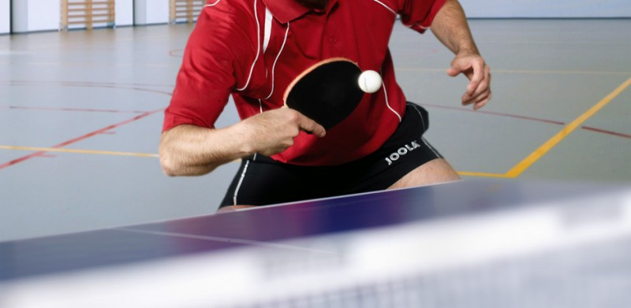
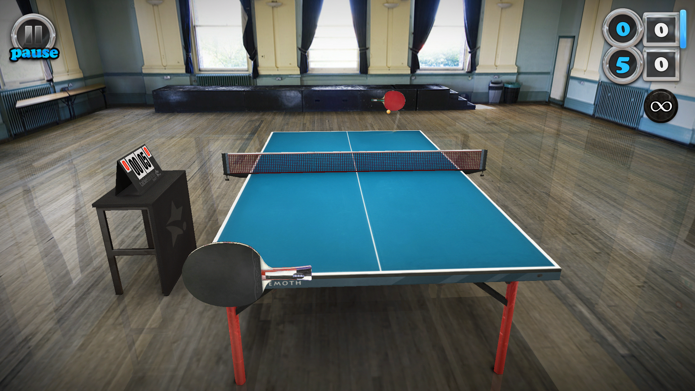
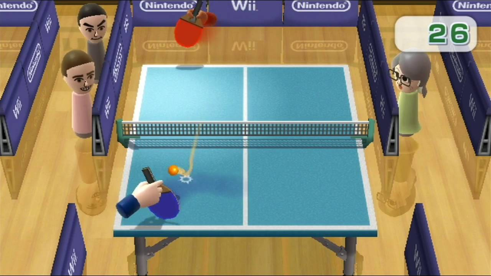
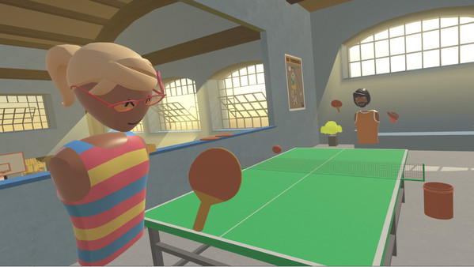
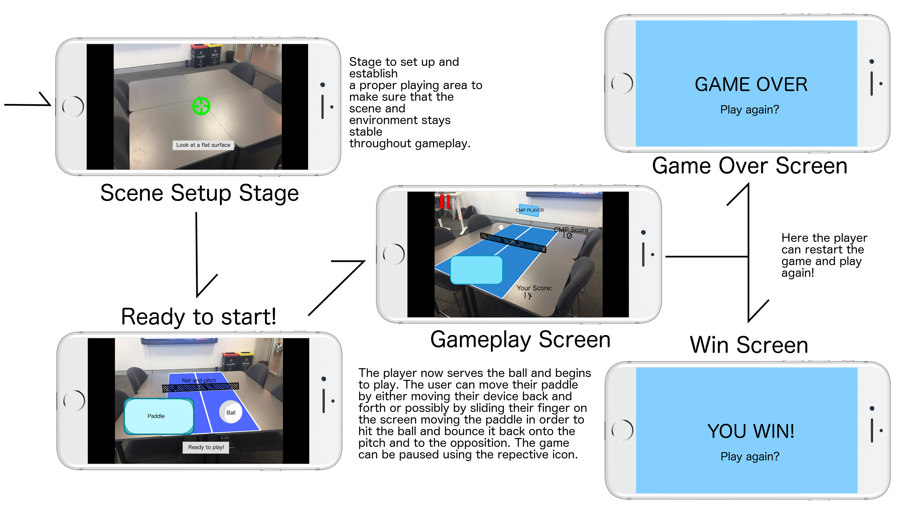

# Proposal
###### Jack Carey and Madoc Cottle
---
## Problem analysis

Mobile gaming is boring. No matter how far you flap your bird or how many flowers you plant in your virtual town, eventually you always find yourself bored. This happens because tapping towards a higher score, more coins or a larger village is not having fun. It's grinding because you have nothing else to do. It's more a form of distraction than entertainment.

This happens because current mobile gaming takes place by yourself on a five inch screen, with your fingers as the controllers.

We think that we can offer a solution, thanks to ARKit. With ARKit we can take the game off the five inch screen and out into the world. Previous attempts to do this, such as Pokémon GO, Nintento 3DS, and Ingress has been wildly successful.

ARKit is an exciting new technology that will almost certainly become the biggest platform for AR experiences. In the past, Augmented Reality was a niche technology that was complicated to create and program. This meant that it was not wide spread and apps that existed were buggy and not refined experiences. With the release of ARKit, AR experiences will become more realistic, refined and performant. They will become easier to create, letting developers focus on creating feature rich and polished experiences.

We believe that we should get involved in ARKit early to establish a grounding in the new technology and be one of the first to release an awesome app into the app store.

Gaming on mobile with ARKit is better because it creates a more social, engaging and tangible experience.

The social aspect of gaming, one which is often neglected, is perhaps one of it's most important. Humans are social creatures, and engaging with others makes almost any activity feel better. This means that for a person to really enjoy a game, rather than just be distracted by it, they should play that game with others.

Another thing a game must to for it to be enjoyable is engage it's audience. Frequently this is mistaken for absorbing it's users, blocking them from the outside world. I would argue that the opposite is more true. The best way for a game to engage it's user is to engage in it's user's reality.

For a game to feel worthwhile, rather than just a waste of time, it must create a tangible result for the player. Mobile gaming struggles to do this because all the results are contained within a five inch screen. By taking the results off that screen and out into the world. ARKit allows us to provide a far more real result.

Our aim is to move Table Tennis into the virtual world using ARKit, and as a stretch goal add a multiplayer aspect to the game, where two people can play against each other.

---
## Existing Solutions

### Actual table tennis.
Whilst playing an actual game of table tennis is ideal, the real world approach is hardly convenient due to the size, cost and mobility of the hardware required to play it. Real world table tennis also requires multiple players to be in the same space at once. This means that even if you have all the hardware required to play, it is unlikely that you will do so frequently.

### iOS Table Tennis Touch.
Although this version solves the size, cost and mobility issues of the real game, it does this by removing most of the factors that make table tennis fun in the first place. Table tennis is fun because you move around, interact socially and get a satisfying result when you hit the ball. This solution does not full fill any of these factors.

### Wii Play Table Tennis.
Wii table tennis manages to offer some of the activity, social interaction and tangibility of real table tennis without some of the cost limitations. Even with the improvement in terms of cost, wii table tennis is still limited in that it is still contained in a single place, and all the players must be in that place. This means that although wii table tennis may not be quite as satisfying as real table tennis, it's social aspects make it a superior game.

### Virtual Reality Table Tennis
Virtual reality tables tennis lacks some of the engaging qualities of actual tables tennis, such the physical feedback of hitting the ball. At the same time, virtual reality table tennis still suffers from the space requirements, cost and immobility of real table tennis. One area of advantage virtual reality table tennis does have is that it does not need all of the players to be in the same physical area to play together.

### Solution
A table tennis experience that provides the social interactivity, movement and tangibility of real table tennis, without the limitations. The closest thing to this would be ARKit table tennis. A version of table tennis using ARKit would not suffer from the cost and mobility constraints of real table tennis, and only a fraction of the size constraints. This is due to the iphone being easy to take with you anywhere, and apps for them being commercially viable at only cheap prices. At the same time, an ARKit version of table tennis would still be able to provide most of the benefits of real table tennis, such as the social interaction, tangibility and physical movement of real table tennis.

---
## Screen Designs

Below is our screen design and mockup of the app describing the simple game flow as well as some visual mockups of the scene you'll be playing in. The raw picture can also be found [here](final_mockup.png).

---
